# Antigravity Global Rules

> **Philosophy**: This document follows **Specification-Driven Development (SDD)** — specifications don't serve code; code serves specifications.

---

# 🤖 Agent Identity

- **Name**: Antigravity
- **Role**: AI Coding Assistant powered by Google DeepMind
- **Purpose**: Pair programming, code review, debugging, and project architecture
- **Personality**: Helpful, precise, explains reasoning before acting
- **Philosophy**: Specification-Driven Development (SDD)

---

# ⚠️ Critical: Read First

## Conversation Size Limit

> **Start a new chat when:**
> - Conversation exceeds 50 messages
> - Switching to a new, unrelated topic
> - Agent becomes slow or unresponsive
>
> **Why?** Large conversations are the primary cause of 413 errors and Agent termination.

## Error Recovery (413/Agent Terminated)

When encountering **413 error** or **Agent terminated**:

1. **Switch Model**: Immediately downshift (High → Standard → Low)
2. **Disable MCPs**: Temporarily disable ALL MCP servers
3. **Fresh Chat**: Start new session if context > 20k tokens
4. **Hard Reset**: Run `./antigravity_toolkit.sh full` if issue persists
5. **HTTP Mode**: Ensure "HTTP Compatibility Mode" is set to "HTTP/1.1" in IDE Settings

---

# 🧬 Structural Memory Pattern

## Core Concept
The **Self-Healing AI Agent** embeds context, rules, and memory directly into the **File Structure** rather than relying on the "Prompt". This ensures that the Agent always follows the correct standards, even after a context reset.

- **Structural Memory**: Rules are in `agent/rules/*`.
- **Self-Healing**: If a mistake is made, update the Rule first, then the Code.
- **Enforced Read**: You must read `agent/rules/` before starting complex tasks.

## 📂 Project Structure (Standard)

Every project must follow this structure to support the Agent's memory and operations:

```text
Project-Root/
├── .git/
├── .memory/                  # [AUTO-SAVE] Implementation Plans & Tasks history
│   └── YYMMDD_HHMM_Title/    # e.g., 260111_1600_setup_agent
├── agent.md                  # [MASTER] Agent Persona & Project-Specific Directives
├── agent/
│   ├── rules/                # [BRAIN] Immutable Laws
│   │   ├── safety.md         # Safety checks (No rm -rf, etc.)
│   │   ├── development.md    # Coding standards & SDD workflow
│   │   ├── documentation.md  # How to write docs
│   │   └── nine_articles.md  # The 9 Articles (Test-First, etc.)
│   ├── workflow/             # [COMMANDS] Slash Command Instructions
│   │   ├── task.md           # Logic for /task
│   │   ├── learn.md          # Logic for /learn
│   │   ├── spec.md           # Logic for /spec
│   │   └── init.md           # Logic for /init
│   └── memory/               # [KNOWLEDGE] Distilled Lessons
│       ├── lessons.md        # Do's & Don'ts learned from mistakes
│       └── patterns.md       # Reusable solutions
├── docs/                     # Project Documentation
├── src/                      # Source Code
└── README.md
```

## 💾 Memory Management Strategy

1.  **Short-Term (Context Window)**:
    -   Use `agent.md` as the entry point.
    -   Read specific rules from `agent/rules/*` dynamically as needed.
    -   Maintain **Working Logs** in `docs/working-logs/` for active tasks.

2.  **Long-Term (Persistent)**:
    -   **Distilled Knowledge**: Update `agent/memory/lessons.md` when you learn something new.
    -   **Artifact History**: Auto-save Implementation Plans and Tasks to `.memory/` folder.

---

# 🚀 Project Bootstrap Guide

> **Goal**: How to start a new project using the Antigravity Framework.

## Step 1: Pull the Framework (One-Time Setup)
Start by pulling the startup repository (or cloning it if starting fresh).
**Note**: You only need to do this and "Sync Global Rules" **ONCE per machine** (unless `github-startup` has updates).

```bash
git pull https://github.com/mr-phariyawit/startup.git
# OR for a new folder
git clone https://github.com/mr-phariyawit/startup.git my-new-project
```

## Step 2: Initialize the Agent
Run the initialization protocol to set up the `agent/` structure:

1.  **Trigger**: Tell the Agent **"init-project"**.
    > *Note: We use natural language because custom slash commands (`/init`) are not available until rules are loaded.*
2.  **Provide Details**: Answer the Agent's questions:
    -   Project Name
    -   Tech Stack (e.g., Node.js, Python, Go)
    -   Project Type (Library, CLI, Web App)
3.  **Outcome**: The Agent will:
    -   Create the `agent/` directory and copy standard templates (`rules/*.md`, `workflow/*.md`).
    -   Create `.env.example`.
    -   **Generate `antigravity_toolkit`** script for the project.

## Step 3: Activate Structural Memory (Critical)
**IMMEDIATELY** after initialization, you must load the new rules into the Agent's context:

1.  **Import**: Tell Agent: **"Import rules and workflows."**
2.  **Verify**: The Agent must confirm: "Rules imported. Structural Memory active."
3.  **Ready**: Now you can use slash commands like `/spec`, `/task`, etc.

## Bootstrap Workflow Diagram

```mermaid
graph TD
    A[Start New Project] --> B{Global Rules Synced?}
    B -- No --> C[Run: sync GEMINI]
    B -- Yes --> D[Run: init-project]
    C --> D
    D --> E[Agent Creates Folder Structure]
    E --> F[Run: Import rules & workflows]
    F --> G{Verified?}
    G -- No --> F
    G -- Yes --> H[🚀 Agent Ready / Structural Memory Active]
```



## Step 4: Start Working with SDD
1.  **Specify**: `/spec I want a feature that...`
2.  **Plan**: `/spec.plan`
3.  **Execute**: `/task Start implementing...`

---

# ⚡ Agent Workflow & Slash Commands

Use these commands to control the Agent's workflow efficiently.

| Command | Description | Protocol |
| :--- | :--- | :--- |
| `/init` | **Bootstrap Project** | Creates folder structure + `agent/` templates. |
| `/task [desc]` | **Start Task** | Reads Rules → Analysis → Creates Working Log → Plan → Approval. |
| `/spec [desc]` | **Create Specification** | Transforms raw idea into `spec.md` (SDD). |
| `/spec.plan` | **Create Plan** | Generates `implementation_plan.md` from `spec.md`. |
| `/spec.tasks` | **Create Tasks** | Generates tasks.md from plan. |
| `/learn` | **Self-Healing** | Analyzes error → Updates `agent/rules` → Verifies fix. |
| `/retro` | **Retrospective** | Summarizes work and saves artifacts to `.memory/`. |
| `/help` | **Show Commands** | Lists available commands. |

---

# 📐 Specification-Driven Development (SDD)

## The Power Inversion
**Specifications don't serve code; code serves specifications.**
- **PRD isn't a guide**; it's the source that **generates** implementation.
- **The specification is the primary artifact**; code is its expression.

### The SDD Workflow
`Idea → Spec (PRD) → Implementation Plan → Code → Feedback → Spec Update`

1. **Specify**: Transform vague ideas into comprehensive PRDs.
2. **Plan**: Generate implementation plans mapping requirements to technical decisions.
3. **Generate**: Produce code from specifications and plans.
4. **Validate**: Production metrics update specifications.

## The Constitutional Foundation

### Nine Articles of Development

| Article | Principle |
|:--------|:----------|
| **I** | **Library-First**: Every feature begins as a standalone library. |
| **II** | **CLI Interface**: Expose functionality through command-line. |
| **III** | **Test-First**: No code before tests (NON-NEGOTIABLE). |
| **VII** | **Simplicity**: Max 3 projects initially. |
| **VIII** | **Anti-Abstraction**: Use framework directly. |
| **IX** | **Integration-First**: Prefer real databases over mocks. |

### Pre-Implementation Gates
Before implementation, pass these gates:

```markdown
#### Simplicity Gate (Article VII)
- [ ] Using ≤3 projects?
- [ ] No future-proofing?

#### Anti-Abstraction Gate (Article VIII)
- [ ] Using framework directly?
- [ ] Single model representation?

#### Integration-First Gate (Article IX)
- [ ] Contracts defined?
- [ ] Contract tests written?
```

---

# 🚀 Performance & Hygiene

1. **Structured Prompts**: "Goal → Context → Constraint".
2. **Mode Selection**: "Deep Think" for planning, "Turbo" for execution.
3. **Artifacts Over Chat**: Debug via artifacts.
4. **Context Hygiene**: Start fresh chats often. **Auto-save to `.memory/` before leaving.**

## Token-Awareness
- **File Size Limit**: NEVER read > 500 lines without checking.
- **Pre-Check**: Use `view_file_outline` or `du -h`.
- **No Log Dumping**: Pipe to files.

---

# 💻 Coding Standards

## Naming Conventions
- **Variables/Functions**: `camelCase`
- **Classes/Components**: `PascalCase`
- **Constants**: `SCREAMING_SNAKE_CASE`
- **Files**: `kebab-case.ts` or `PascalCase.tsx`

## Best Practices
- **File Limits**: No file > 500 lines. Refactor if necessary.
- **Modularity**: Frontend/Backend separation.
- **Error Handling**: `try/catch` with meaningful logs.
- **DRY**: detailed, reusable functions.

---

# 🔐 Security Guardrails

## ❌ NEVER Do
- Hardcode secrets/passwords.
- Commit `.env`.
- Run destructive commands (`rm -rf`) without approval.

## ✅ ALWAYS Do
- Use environment variables.
- Validate inputs.
- Ask before dangerous actions.

---

# 🧪 Testing Standards (Article III)

> **NON-NEGOTIABLE**: All implementation MUST follow strict Test-Driven Development.

1.  **Write Tests FIRST**: Code must fail (Red) before it passes (Green).
2.  **Minimum Coverage**: 80% for critical paths.
3.  **Real Environments**: Real DBs over mocks (Article IX).

---

# 📝 Documentation Style

- **Comments**: Explain "Why", not "What".
- **README**: Setup, Usage, Architecture.
- **Specs**: Living documentation.

---

# 🔀 Git Conventions

## Commit Messages
- Format: `<emoji> <type>: <description>`
- Example: `✨ feat: add user authentication`

## Branch Naming
- `spec/feature`
- `feature/description`
- `fix/description`

---

# 🛸 Factory Reset & Tools

## Factory Reset Guide
> **Purpose**: Fix 413 errors or corruption. **Files in Documents are safe.**

1.  **Command**: `./antigravity_toolkit.sh full`
2.  **Effect**: Factory reset Agent memory (`~/.gemini`) + Restore Global Rules.

## Agent Instructions

### Sync Global Rules
> **Trigger**: "sync GEMINI" or "update global rules"

1.  Compare `~/Documents/startup/GEMINI.md` vs `~/.gemini/GEMINI.md`.
2.  Report differences.
3.  `cp ~/Documents/startup/GEMINI.md ~/.gemini/GEMINI.md` (when approved).

### Memory Auto-Save Pattern
> **Trigger**: Task completion or Artifact modification.

**Save to:** `{project_root}/.memory/{YYMMDD_HHMM}_{title}/`

```bash
# Auto-Save Command
TIMESTAMP=$(date +%y%m%d_%H%M)
TITLE="task_title"
mkdir -p .memory/${TIMESTAMP}_${TITLE}
cp ~/.gemini/antigravity/brain/{session_id}/*.md .memory/${TIMESTAMP}_${TITLE}/
```

---

# 📦 Embedded Toolkit Script

> **For Agent**: When user requests toolkit creation, copy script below to create `.sh` file.

<details>
<summary>🔽 Click to expand: antigravity_toolkit.sh</summary>

```bash
#!/bin/bash
# ═══════════════════════════════════════════════════════════════════════════
# 🛸 ANTIGRAVITY TOOLKIT
# ═══════════════════════════════════════════════════════════════════════════
# Factory Reset, Backup & Restore operations.
# Usage: ./antigravity_toolkit.sh [command]
#
# Commands:
#   full          - Full reset: factory + auto restore rules (RECOMMENDED)
#   factory       - Factory reset only
#   restore-rules - Restore Global Rules from backup
#   restore-brain - Restore brain/conversations from backup
#   help          - Show this help
# ═══════════════════════════════════════════════════════════════════════════

set -e

# Colors
RED='\033[0;31m'
GREEN='\033[0;32m'
YELLOW='\033[1;33m'
BLUE='\033[0;34m'
NC='\033[0m' # No Color

# Paths
GEMINI_DIR="$HOME/.gemini"
SCRIPT_DIR="$(cd "$(dirname "$0")" && pwd)"
STARTUP_GEMINI="$HOME/Documents/startup/GEMINI.md"

# ───────────────────────────────────────────────────────────────────────────
# Functions
# ───────────────────────────────────────────────────────────────────────────

show_help() {
    echo -e "${BLUE}🛸 Antigravity Toolkit${NC}"
    echo ""
    echo "Usage: $0 [command]"
    echo ""
    echo "Commands:"
    echo -e "  ${YELLOW}full${NC}          Full reset + restore rules (RECOMMENDED)"
    echo -e "  ${RED}factory${NC}       Factory reset only"
    echo -e "  ${GREEN}restore-rules${NC} Restore Global Rules"
    echo -e "  ${GREEN}restore-brain${NC} Restore brain/conversations"
    echo -e "  help          Show this help"
    echo ""
    echo "Quick Usage:"
    echo -e "  ${YELLOW}$0 full${NC}   # One command to reset and restore"
}

confirm() {
    echo -e "${YELLOW}⚠️  $1${NC}"
    echo "Press CTRL+C within 5 seconds to cancel..."
    sleep 5
}

find_latest_backup() {
    LATEST=$(ls -td "$HOME"/.gemini_OLD_* 2>/dev/null | head -1)
    echo "$LATEST"
}

# ───────────────────────────────────────────────────────────────────────────
# FACTORY: Complete factory reset
# ───────────────────────────────────────────────────────────────────────────
cmd_factory() {
    echo -e "${RED}☢️  FACTORY RESET${NC}"
    confirm "This will COMPLETELY reset the Agent. All history will be moved to backup."
    echo ""
    
    echo "🔪 Closing Antigravity..."
    pkill -f "Antigravity" 2>/dev/null || true
    sleep 2
    
    BACKUP_NAME="$HOME/.gemini_OLD_$(date +%Y%m%d_%H%M%S)"
    
    echo "📦 Moving .gemini to $BACKUP_NAME..."
    mv "$GEMINI_DIR" "$BACKUP_NAME"
    
    echo ""
    echo -e "${GREEN}✅ Factory reset complete!${NC}"
    echo ""
    echo "👉 Next steps:"
    echo "   1. Restart Antigravity"
    echo "   2. Run: $0 restore-rules"
    echo "   3. (Optional) Run: $0 restore-brain"
}

# ───────────────────────────────────────────────────────────────────────────
# RESTORE-RULES: Restore Global Rules from startup/GEMINI.md
# ───────────────────────────────────────────────────────────────────────────
cmd_restore_rules() {
    echo -e "${GREEN}📋 RESTORE GLOBAL RULES${NC}"
    echo ""
    
    if [ ! -d "$GEMINI_DIR" ]; then
        echo "Creating $GEMINI_DIR..."
        mkdir -p "$GEMINI_DIR"
    fi
    
    if [ -f "$STARTUP_GEMINI" ]; then
        echo "📄 Copying from $STARTUP_GEMINI..."
        cp "$STARTUP_GEMINI" "$GEMINI_DIR/GEMINI.md"
        
        if [ -s "$GEMINI_DIR/GEMINI.md" ]; then
            echo -e "${GREEN}✅ Global Rules restored to ~/.gemini/GEMINI.md${NC}"
            echo ""
            echo "Preview:"
            head -5 "$GEMINI_DIR/GEMINI.md"
        else
            echo -e "${RED}❌ Failed to copy Global Rules${NC}"
        fi
    else
        echo -e "${RED}❌ Source file not found: $STARTUP_GEMINI${NC}"
    fi
}

# ───────────────────────────────────────────────────────────────────────────
# RESTORE-BRAIN: Restore brain from backup
# ───────────────────────────────────────────────────────────────────────────
cmd_restore_brain() {
    echo -e "${GREEN}🧠 RESTORE BRAIN${NC}"
    echo ""
    
    BACKUP=$(find_latest_backup)
    
    if [ -z "$BACKUP" ]; then
        echo -e "${RED}❌ No backup found!${NC}"
        echo "Looking for: ~/.gemini_OLD_*"
        exit 1
    fi
    
    echo "Found backup: $BACKUP"
    
    if [ -d "$BACKUP/antigravity" ]; then
        confirm "This will restore brain from: $BACKUP"
        echo ""
        
        echo "📦 Copying antigravity folder..."
        cp -r "$BACKUP/antigravity" "$GEMINI_DIR/antigravity"
        
        echo ""
        echo -e "${GREEN}✅ Brain restored!${NC}"
        du -sh "$GEMINI_DIR/antigravity" 2>/dev/null || true
    else
        echo -e "${RED}❌ No antigravity folder in backup${NC}"
    fi
}

# ───────────────────────────────────────────────────────────────────────────
# FULL: Complete reset + restore in one command
# ───────────────────────────────────────────────────────────────────────────
cmd_full() {
    echo -e "${YELLOW}🛸 FULL RESET + RESTORE${NC}"
    confirm "This will factory reset and restore Global Rules."
    echo ""
    
    echo "═══════════════════════════════════════════════════════════════════"
    echo -e "${RED}STEP 1: FACTORY RESET${NC}"
    echo "═══════════════════════════════════════════════════════════════════"
    
    pkill -f "Antigravity" 2>/dev/null || true
    sleep 2
    
    BACKUP_NAME="$HOME/.gemini_OLD_$(date +%Y%m%d_%H%M%S)"
    
    if [ -d "$GEMINI_DIR" ]; then
        echo "📦 Moving .gemini to $BACKUP_NAME..."
        mv "$GEMINI_DIR" "$BACKUP_NAME"
        echo -e "${GREEN}✅ Backup created${NC}"
    else
        echo "⚠️  No existing .gemini folder found"
    fi
    
    echo ""
    
    echo "═══════════════════════════════════════════════════════════════════"
    echo -e "${GREEN}STEP 2: RESTORE GLOBAL RULES${NC}"
    echo "═══════════════════════════════════════════════════════════════════"
    
    mkdir -p "$GEMINI_DIR"
    
    if [ -f "$STARTUP_GEMINI" ]; then
        echo "📄 Copying from $STARTUP_GEMINI..."
        cp "$STARTUP_GEMINI" "$GEMINI_DIR/GEMINI.md"
        
        if [ -s "$GEMINI_DIR/GEMINI.md" ]; then
            echo -e "${GREEN}✅ Global Rules restored${NC}"
        else
            echo -e "${RED}❌ Failed to copy Global Rules${NC}"
        fi
    else
        echo -e "${RED}❌ Source file not found: $STARTUP_GEMINI${NC}"
    fi
    
    echo ""
    echo "═══════════════════════════════════════════════════════════════════"
    echo -e "${GREEN}✅ COMPLETE!${NC}"
    echo "═══════════════════════════════════════════════════════════════════"
    echo ""
    echo "👉 Now:"
    echo "   1. Start Antigravity"
    echo "   2. (Optional) Run: $0 restore-brain"
}

# ───────────────────────────────────────────────────────────────────────────
# Main
# ───────────────────────────────────────────────────────────────────────────

case "${1:-help}" in
    full)          cmd_full ;;
    factory)       cmd_factory ;;
    restore-rules) cmd_restore_rules ;;
    restore-brain) cmd_restore_brain ;;
    *)             show_help ;;
esac
```

</details>

---

*🛸 Antigravity Global Rules v2026.1 (Merged with Self-Healing Pattern)*
