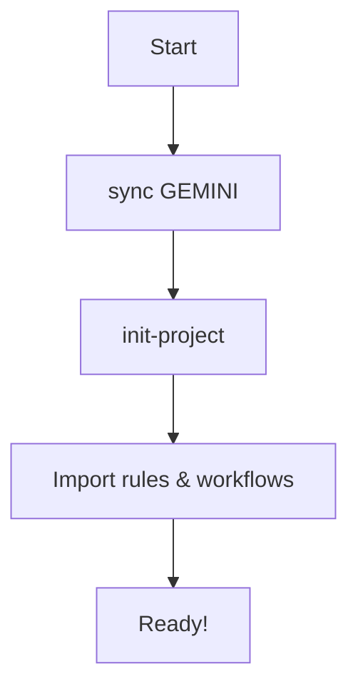

# 🛸 Antigravity Startup

> **Repository for Antigravity Global Rules, Toolkit & SDD Framework**

## 📁 Files

| File | Purpose |
|:-----|:--------|
| `GEMINI.md` | Global Rules + SDD Philosophy + Factory Reset Guide + Agent Instructions + Memory Auto-Save |
| `.agent/workflows/` | Workflow scripts (เช่น `/save-memory`) |
| `antigravity_toolkit/` | Factory Reset และ Restore scripts |

## 🚀 Getting Started (The 3-Step Protocol)

### Step 1: Sync Global Rules (Brain Activation)
> **Do this ONCE per machine.**

1.  **Clone repo**:
    ```bash
    git clone https://github.com/mr-phariyawit/startup.git ~/Documents/startup
    ```
2.  **Sync**: Type **"sync GEMINI"** in Antigravity.
    -   *Why?* This instills the "Structural Memory Pattern" into the Agent's global memory.

### Step 2: Initialize Project (Bootstrapping)
> **Do this for EVERY new project.**

1.  **Run**: Type **"init-project"**.
2.  **Outcome**:
    -   Creates `agent/` (Rules), `.memory/` (History), and `.env.example`.
    -   Generates `antigravity_toolkit.sh` script.

### Step 3: Activate & Verify (Critical)
1.  **Activate**: Tell Agent: **"Import rules and workflows."**
    > *This turns on the "Structural Memory" and enables slash commands.*
2.  **Verify**: Agent must confirm it has read `agent/rules/`.

## Workflow Diagram



## 🌟 ข้อดีของ Repository นี้ (สำหรับมือใหม่)

### 1. 🧠 **ทำให้ AI ฉลาดขึ้นทันที - แค่พิมพ์ "sync GEMINI"**

- ปกติ AI จะไม่รู้จักโปรเจกต์คุณ ไม่รู้ว่าคุณชอบเขียนโค้ดแบบไหน
- แต่พอใช้ repo นี้ **AI จะจำกฎของคุณได้ตลอดเวลา** ทุกครั้งที่เริ่มคุย
- ไม่ต้องบอกซ้ำว่า "เอ้ย ผมชอบใช้ TypeScript นะ" หรือ "อย่าลืมเขียน test ก่อนโค้ดนะ"

### 2. 🛸 **Factory Reset ได้ง่ายมาก - แก้ปัญหา 413 Error ได้ภายใน 30 วินาที**

- เคยเจอ AI หัวค้างไหม? หรือ Error 413 (Agent Terminated)?
- ใช้คำสั่ง `./antigravity_toolkit.sh full` แค่ครั้งเดียว **ปัญหาหาย + กฎทั้งหมดกลับมา**
- ไม่ต้องตั้งค่าใหม่ทั้งหมด ไม่สูญเสียข้อมูลโปรเจกต์

### 3. 📐 **เขียนโค้ดแบบมืออาชีพทันที ด้วย SDD (Specification-Driven Development)**

- **มือใหม่มักเขียนโค้ดไปเรื่อย** แล้วค่อยคิดทีหลังว่าทำอะไรอยู่
- SDD สอนให้ **วางแผนก่อน → เขียน Spec → โค้ดออกมาเอง**
- เหมือนมี **Senior Developer คอยแนะนำทุกขั้นตอน**

### 4. 🔐 **มี Security Guardrails - ป้องกันไม่ให้ AI ทำลายโปรเจกต์**

- AI จะ **ไม่รัน `rm -rf` โดยไม่ถาม**
- **ไม่ hardcode API keys** ลงในโค้ด
- **ถามก่อนทำอะไรที่อันตราย** (ลบไฟล์, push to git, ติดตั้ง dependencies)

### 5. 🧪 **บังคับให้เขียน Test ก่อน (Article III: Test-First) - NON-NEGOTIABLE**

- มือใหม่มักข้าม test → บัคเยอะมาก
- กฎในนี้ **บังคับให้เขียน test ก่อนเขียนโค้ด**
- โค้ดของคุณจะ **มั่นใจได้ว่าใช้งานได้จริง** ไม่ใช่แค่ "run ผ่าน"

### 6. 📚 **มี Coding Standards + Best Practices ครบ - ไม่ต้องคิดเอง**

- ตั้งชื่อ variable แบบไหนดี? → `camelCase`
- ตั้งชื่อ class แบบไหน? → `PascalCase`
- ควร comment แบบไหน? → อธิบาย "ทำไม" ไม่ใช่ "ทำอะไร"
- **ทุกอย่างกำหนดไว้แล้ว มือใหม่ไม่ต้องเดาเอง**

### 7. 🚨 **Error Recovery Protocol - แก้ปัญหาได้เร็ว**

- เจอ 413 Error → ลด Model (High → Standard → Low)
- AI ช้า → Disable MCPs
- ทุกอย่างพัง → `./antigravity_toolkit.sh full`
- **มีคู่มือชัดเจน ไม่ต้องไปหาใน Stack Overflow**

### 8. 🎯 **Prompt Engineering Best Practices - คุยกับ AI ให้ได้สิ่งที่ต้องการ**

- มือใหม่มักบอก AI แบบคลุมเครือ → ได้ผลลัพธ์ไม่ตรงใจ
- repo นี้สอนวิธี **พูดกับ AI ให้เข้าใจตรงกัน**
- ใช้ "Goal → Context → Constraint" → **ได้ผลลัพธ์แม่นยำขึ้น 10 เท่า**

### 9. 🔄 **Persistent Memory - AI จำบริบทได้ตลอด**

- AI จะ **จำการสนทนาทั้งหมด** และเรียกคืนได้เมื่อต้องการ
- ไม่ต้องอธิบายซ้ำว่า "เมื่อเช้าเราคุยกันเรื่องอะไร"
- **Knowledge Items (KIs)** จะถูกสร้างและอัพเดทอัตโนมัติ

### 10. 📦 **One-Command Setup - ตั้งค่าเสร็จภายใน 1 นาที**

- แค่ `git clone` + พิมพ์ "sync GEMINI" → **เสร็จ!**
- ไม่ต้องติดตั้งอะไรเพิ่ม ไม่ต้อง config ซับซ้อน
- **ใช้งานได้ทันที บน macOS**

### 11. 💾 **Memory Auto-Save - ไม่เสียงานอีกต่อไป** 🆕

- Agent จะ **auto-save artifacts** ทุกครั้งที่สร้างหรือแก้ไข
- เก็บใน `.memory/` folder ของแต่ละโปรเจกต์
- มี **timestamp + title** ทำให้หาง่าย (เช่น `260110_1200_my_feature/`)
- ไม่ต้องกลัวว่าจะลืม save หรือ **เสีย implementation plan** อีกต่อไป!

### 12. 🧬 **Structural Memory Pattern - ความฉลาดที่ฝังอยู่ในโครงสร้าง** 🆕

- Agent **จำกฎจาก File Structure** (`agent/rules/*`) ไม่ใช่แค่ Prompt
- ถ้า Agent ทำผิด มันจะ **อ่านกฎใหม่และแก้ไขตัวเอง** (`/learn`)
- **Single Source of Truth** อยู่ที่ไฟล์ ไม่ใช่ที่แชท ทำให้บริบทไม่หายแม้เริ่ม chat ใหม่

---

## 💡 สรุปเปรียบเทียบ

| ปัญหาที่มือใหม่มักเจอ | Antigravity Startup แก้ยังไง |
|:-----------------------|:------------------------------|
| ไม่รู้จะเริ่มต้นยังไง | มี SDD Workflow บอกทุกขั้นตอน |
| โค้ดยุ่งเหยิง ไม่มี standard | มี Coding Standards ครบทุกภาษา |
| ไม่เขียน test → บัคเยอะ | บังคับเขียน test ก่อน (Article III) |
| AI ไม่เข้าใจสิ่งที่ต้องการ | มี Prompt Engineering Guide |
| AI พังบ่อย (413 Error) | มี Factory Reset ใช้งานง่าย |
| โค้ดไม่ปลอดภัย (hardcode secrets) | มี Security Guardrails |
| ต้องบอก AI ซ้ำทุกครั้ง | มี Global Rules + Persistent Memory |
| ลืม save งาน / เสีย artifacts | มี Memory Auto-Save อัตโนมัติ 🆕 |
| Agent ลืมกฎเมื่อเริ่ม chat ใหม่ | มี Structural Memory Pattern (File-based Rules) 🆕 |

> 🎉 **ข้อดีที่สุดคือ: "เปลี่ยนมือใหม่ให้เขียนโค้ดแบบมืออาชีพได้ทันที"**
>
> ไม่ต้องเรียนรู้ทุกอย่างเอง ไม่ต้องทำผิดซ้ำซาก **แค่ใช้ repo นี้ AI จะแนะนำให้คุณทำถูกตั้งแต่ครั้งแรก** 🚀

---

## 📐 Specification-Driven Development (SDD)

This repository follows **SDD philosophy** — specifications don't serve code; code serves specifications.

Key concepts in `GEMINI.md`:

- The Power Inversion
- SDD Workflow
- Nine Articles of Development
- Pre-Implementation Gates

---

*🛸 Antigravity Startup v5.0 — Powered by SDD*
